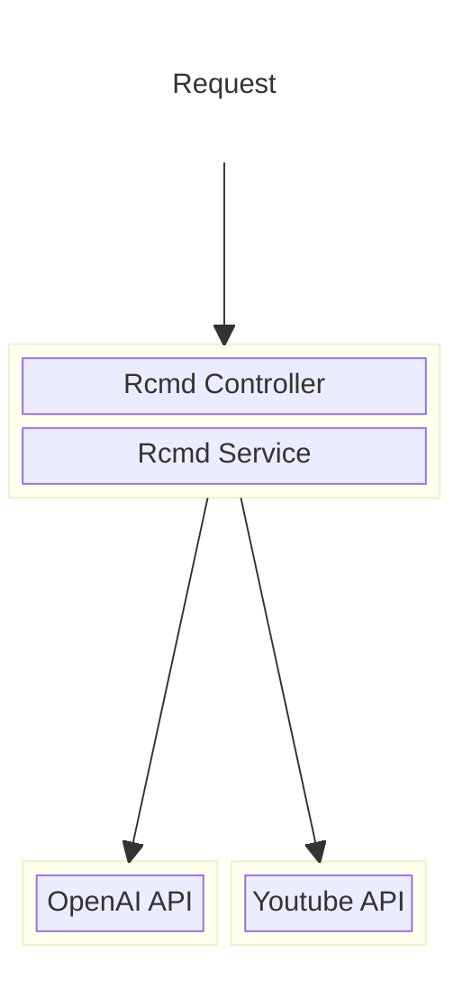
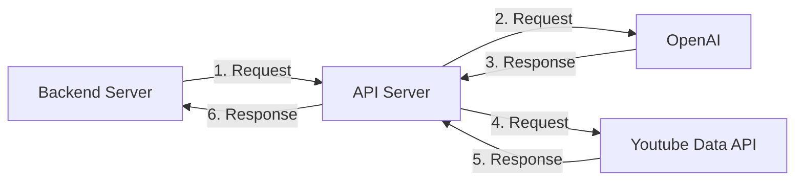

# LLM API Server README

## Server Architecture



## API Route



### POST /api/rcmd/openai
- Recommend three songs based on the input diary.

#### Request format
- `emotion` and `filter` is optional

```json
{
    "user_id": "string",
    "diary": "string",
    "emotion": [
        "string"
    ],
    "filter": {
        "genre": "string",
        "artist": "string",
        "year": "string",
        "mood": "string"
    }
}
```
#### Response format
```json
[
    {
        "title": "string",
        "artist": "string",
        "url": "string"
    },
    {
        "title": "string",
        "artist": "string",
        "url": "string"
    },
    {
        "title": "string",
        "artist": "string",
        "url": "string"
    }
]
```

### PUT /api/rcmd/openai *(not implemented)*
- next recommendation will be based on the previous recommendation
- this request is saved in the database using this format

#### Request format
```json
{
    "user_id": "string",
    "music": {
        "title": "string",
        "artist": "string",
        "url": "string"
    }
}
```

#### Response format
```json
{
    "message": "string"
}
```
